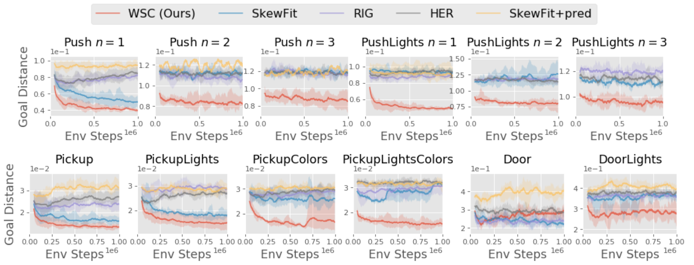
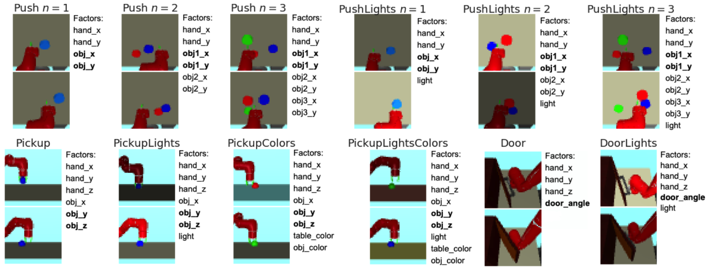

# Weakly-Supervised RL for Controllable Behavior

## Preliminaries

Clone this repo:
```
git clone https://github.com/google-research/weakly_supervised_control
git submodule update --init
```
Create the conda environment by running:
```
conda env create -f conda_envs/linux-gpu-env.yml  # Linux
conda env create -f conda_envs/mac-cpu-env.yml  # Mac OS
```
To delete the conda environment, run `conda env remove -n wsc_env`.

## Quick Start

To train weakly-supervised control (WSC) with pre-trained disentangled representations, run:
```
python -m scripts.train_wsc --config configs/Push1.txt
python -m scripts.train_wsc --config configs/Push2.txt
python -m scripts.train_wsc --config configs/Push3.txt
python -m scripts.train_wsc --config configs/PushLights1.txt
python -m scripts.train_wsc --config configs/PushLights2.txt
python -m scripts.train_wsc --config configs/PushLights3.txt
python -m scripts.train_wsc --config configs/Pickup.txt
python -m scripts.train_wsc --config configs/PickupLights.txt
python -m scripts.train_wsc --config configs/PickupColors.txt
python -m scripts.train_wsc --config configs/PickupLightsColors.txt
python -m scripts.train_wsc --config configs/Door.txt
python -m scripts.train_wsc --config configs/DoorLights.txt
```



## Reproducing experimental results

See below to generate datasets and train disentangled representations from scratch.

### Dataset generation

Generate datasets by running:
```
python -m scripts.generate_sawyer_datasets --env-id SawyerPushNIPSEasy-v0
python -m scripts.generate_sawyer_datasets --env-id SawyerPush2PucksEnv-v1
python -m scripts.generate_sawyer_datasets --env-id SawyerPush3PucksEnv-v1
python -m scripts.generate_sawyer_datasets --env-id SawyerPushRandomLightsEnv-v1
python -m scripts.generate_sawyer_datasets --env-id SawyerPush2PucksRandomLightsEnv-v1
python -m scripts.generate_sawyer_datasets --env-id SawyerPush3PucksRandomLightsEnv-v1
python -m scripts.generate_sawyer_datasets --env-id SawyerPickupGoalEnv-v1
python -m scripts.generate_sawyer_datasets --env-id SawyerPickupRandomLightsEnv-v1
python -m scripts.generate_sawyer_datasets --env-id SawyerPickupRandomColorsEnv-v1
python -m scripts.generate_sawyer_datasets --env-id SawyerPickupRandomLightsColorsEnv-v1
python -m scripts.generate_sawyer_datasets --env-id SawyerDoorGoalEnv-v1
python -m scripts.generate_sawyer_datasets --env-id SawyerDoorRandomLightsEnv-v1
```

By default, the datasets are saved to this location:
```
DATA_DIR=/tmp/weakly_supervised_control/datasets
```


### Disentangled Representation Training

To train disentangled representations on the generated dataset from above, replace `train_dataset` in the config file, then run:
```
python -m scripts.train_disentanglement -c configs/Push1.txt
python -m scripts.train_disentanglement -c configs/Push2.txt
python -m scripts.train_disentanglement -c configs/Push3.txt
python -m scripts.train_disentanglement -c configs/PushLights1.txt
python -m scripts.train_disentanglement -c configs/PushLights2.txt
python -m scripts.train_disentanglement -c configs/PushLights3.txt
python -m scripts.train_disentanglement -c configs/Pickup.txt
python -m scripts.train_disentanglement -c configs/PickupLights.txt
python -m scripts.train_disentanglement -c configs/PickupColors.txt
python -m scripts.train_disentanglement -c configs/PickupLightsColors.txt
python -m scripts.train_disentanglement -c configs/Door.txt
python -m scripts.train_disentanglement -c configs/DoorLights.txt
```

To train WSC using the learned disentangled representation from above, replace `disentanglement_model` in the config file.
